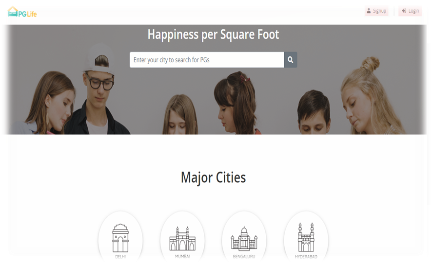

# PG Life – A Student PG Accommodation Portal

  

**PG Life** is a full-stack web application that helps students find paying guest (PG) accommodations in major Indian cities. It provides user-friendly interfaces, search functionality, filters, and personal dashboards to manage preferences.

  

---


## 🧰 Technologies Used

  

### Frontend:

- HTML, CSS, JavaScript

- Bootstrap & jQuery

- FontAwesome (icons)

  

### Backend:

- PHP (vanilla)

- MySQL (via `includes/database_connect.php`)

  

### Optional (React):

- React.js (components in `src/`)

- Babel/Webpack (output JS chunks in `js/`)

  

---

  

## 🔐 Features

  

- 🏙️ View PGs in major cities (Delhi, Mumbai, Bangalore, Hyderabad)

- 🔍 Search PGs by city

- 💖 Mark PGs as "interested"

- 👤 Login/Signup modal with validation

- 📄 Dynamic PG detail page with amenities and ratings

- 📌 User dashboard showing profile & favorite properties

- 🌟 Real-time rating system for cleanliness, food, and safety

- 📸 Image carousel for each property

  

---

  

## 🚀 Getting Started

  

### 1. Clone the repository:

```bash

git clone https://github.com/your-username/kanhaiya70-pg-life.git

cd kanhaiya70-pg-life

````

  

### 2. Set up the database:

  

* Import the SQL file (if available) into MySQL.

* Update credentials in `includes/database_connect.php`.

  

```php

$host = "localhost";

$user = "your_username";

$pass = "your_password";

$db = "pg_life";

```

  

### 3. Run on Localhost:

  

Place the project in your XAMPP/WAMP `htdocs` directory and access via:

  

```

http://localhost/kanhaiya70-pg-life/index.php

```

  

---

  

## 📷 Screenshots

  




  

---

  

## 🙌 Credits

  

* Bootstrap – CSS framework

* FontAwesome – Icons

* jQuery – DOM manipulation

* Internshala Design Reference

  

---

  

## 📃 License

  

This project is licensed under the MIT License.
